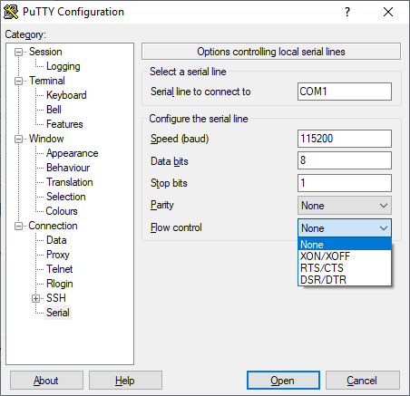

Building for Grapeboard
============

This document will walk you through building all components from source for [Scalys Grapeboard](https://www.grapeboard.com/). The components we will build are

 - RCW, PBL, and U-Boot
 - PPA (Primary Protected Application)
 - OP-TEE
 - Linux

# Building RCW, PBL, and U-Boot

U-Boot is built outside the flexbuild environment. Our branch is forked from the `scalys-lsdk-1803` branch of `git://git.scalys.com/lsdk/u-boot`. Our branch is `https://github.com/ms-iot/SolidRun-u-boot.git` branch `ms-iot-grapeboard`.

```
git clone https://github.com/ms-iot/SolidRun-u-boot.git -b ms-iot-grapeboard
cd SolidRun-u-boot
export ARCH=aarch64
export CROSS_COMPILE=aarch64-linux-gnu-
make grapeboard_pcie_qspi_defconfig
make
```

It will produce a file named `u-boot-with-pbl.bin`. This file must be written to NOR flash.

## Updating U-Boot on NOR Flash

Copy `u-boot-with-pbl.bin` to the root of a FAT-formatted SD card.

Boot into [recovery U-Boot](#booting-grapeboard-into-recovery-mode), then run the following u-boot commands:

```
mmc rescan
fatload mmc 0:1 $load_addr u-boot-with-pbl.bin
sf probe 0:0
sf erase u-boot 200000
sf write $load_addr u-boot $filesize
```

Reset the board. When it reboots, you should see it execute your U-Boot.

# Building PPA and OP-TEE

OP-TEE is forked from `https://source.codeaurora.org/external/qoriq/qoriq-components/optee_os` tag `tags/LSDK-18.09`. OP-TEE is built from `https://github.com/ms-iot/optee_os.git` branch `grapeboard`.

```
flex-builder -c ppa-optee -m ls1012grapeboard
```

It will produce the file `build/firmware/ppa/soc-ls1012/ppa.itb`. This file must be written to NOR flash.

## Updating PPA and OP-TEE on NOR Flash

Copy `ppa.itb` to the root of a FAT-formatted SD card.

Boot into [recovery U-Boot](#booting-grapeboard-into-recovery-mode), then run the following u-boot commands:

```
mmc rescan
fatload mmc 0:1 $load_addr ppa.itb
sf probe 0:0
sf erase ppa 100000
sf write $load_addr ppa $filesize
```

Reset the board. When it reboots, you should see output like the following, which indicates that you successfully updated PPA and OP-TEE.

```
PPA Firmware: Version LSDK-18.09-dirty
SEC Firmware: 'loadables' present in config
loadables: 'trustedOS@1'
```

# Building Linux

Linux is the combination of NXP's layerscape fork (`https://source.codeaurora.org/external/qoriq/qoriq-components/linux`) and grapeboard patches. Grapeboard patches were taken from `git://git.scalys.com/lsdk/linux` branch `grapeboard-proto`. The patches are stored in this repository at `patches/grapeboard-linux.patch` and are applied to NXP's linux tree at build time.

```
flex-builder -c linux -a arm64 -m ls1012grapeboard
flex-builder -i mkrfs -a arm64
flex-builder -i mkbootpartition -m ls1012grapeboard -a arm64
flex-builder -c optee_client -a arm64
flex-builder -c optee_test -a arm64
flex-builder -i merge-component -a arm64 -m ls1012grapeboard
```

This will create a boot partition tarball (`build/images/bootpartition_arm64_<version>.tgz`) and rootfs (`build/rfs/rootfs_ubuntu_bionic_arm64`). We will use the `flex-installer` script to apply them to an SD card.

## Installing Linux to the SD card

You will need a physical linux machine and an 8GB or larger SD card.

Run the following command, where `/dev/sdx` is your SD card. All data on the card will be lost.

```
flex-installer -b build/images/bootpartition_arm64_<version>.tgz -r build/rfs/rootfs_ubuntu_bionic_arm64 -d /dev/sdx
```

Unmount and eject the SD card.

```
udisksctl unmount -b /dev/sdx1
udisksctl unmount -b /dev/sdx2
udisksctl unmount -b /dev/sdx3
udisksctl power-off -b /dev/sdx
```

Insert the SD card to your grapeboard and power on. You should see linux boot. The login credentials are:
```
Username: root
Password: root
```

### Enabling network and SSH

Networking is not configured by default. Until we figure out how to provision the image with networking, use the following commands to enable networking. This only needs to be done once.

```
echo "auto eth0" >> /etc/network/interfaces
echo "iface eth0 inet dhcp" >> /etc/network/interfaces
ifup -a
```

Enable root to login over SSH, and restart SSH server.

```
echo "PermitRootLogin yes" >> /etc/ssh/sshd_config
service sshd restart
```

Wait a little bit for the device to acquire an IP address, then determine the device's IP by running:

```
ifconfig eth0
```

You can now SSH into the device using it's IP address, and `root/root` as login credentials.

# Running OP-TEE tests

This will run the OP-TEE test suite, which will verify that Linux can talk to OP-TEE.

```
tee-supplicant &
xtest -l 0
```

You should see most of the tests pass:

```
...
+-----------------------------------------------------
16081 subtests of which 1 failed
74 test cases of which 1 failed
0 test case was skipped
TEE test application done!
```

# Developing OP-TEE TA's

1. Build optee\_os and optee\_client.
```
flex-builder -c optee_os -m ls1012grapeboard -a arm64
flex-builder -c optee_client -m ls1012grapeboard -a arm64
```

1. Set required environment variables.
```
export TA_DEV_KIT_DIR=$PWD/packages/apps/optee_os/out/arm-plat-ls/export-ta_arm64/
export TEEC_EXPORT=$PWD/build/apps/components_arm64
export HOST_CROSS_COMPILE=aarch64-linux-gnu-
```

1. Change directories outside this repository, and clone `optee_examples`.
```
cd ..
git clone https://github.com/linaro-swg/optee_examples.git
```

1. Build the hello\_world TA and host app.
```
cd optee_examples/hello_world
make
```

1. Copy host executable and TA to target.
```
scp host/optee_example_hello_world root@<ip>:~
scp ta/*.ta root@<ip>:~
```

1. On the target, copy the `.ta` file to `/lib/optee_armtz`.
```
cp *.ta /lib/optee_armtz
```

1. On the target, open a separate SSH window, and start the supplicant.
```
tee-supplicant
```

1. In another window on the target, run the host executable.
```
./optee_example_hello_world
```

You should see the following printed from the host executable:
```
root@localhost:~# ./optee_example_hello_world
Invoking TA to increment 42
TA incremented value to 43
```

And the following from the supplicant window:
```
root@localhost:~# tee-supplicant
D/TA:  TA_CreateEntryPoint:39 has been called
D/TA:  TA_OpenSessionEntryPoint:68 has been called
I/TA:  Hello World!
D/TA:  inc_value:105 has been called
I/TA:  Got value: 42 from NW
I/TA:  Increase value to: 43
I/TA:  Goodbye!
D/TA:  TA_DestroyEntryPoint:50 has been called
```

# Booting Grapeboard into recovery mode

These instructions taken from section 5.3 of the [Grapeboard BSP User Guide](https://www.grapeboard.com/wp-content/uploads/2018/05/scalys_grapeboard_bsp_user_guide_180518.pdf).

1. Connect the Grapeboard to your host PC and open a serial terminal at 115200 8N1. If you're using Putty on Windows, you must go to **Connection -> Serial** and set **Flow control** to **None**.

1. Press and hold switch `S2` on the Grapeboard.
1. Power-up (or reset with switch `S1`) the Grapeboard
1. Release switch `S2` once U-boot prints the message: `Please release the rescue mode button (S2) to enter the recovery mode`

You can now issue commands at the U-Boot prompt.

